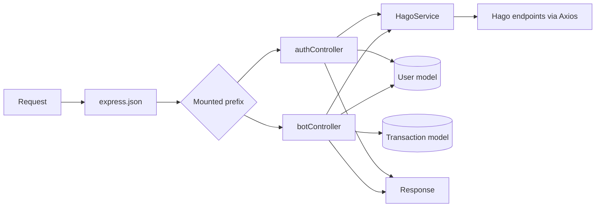

# Architecture and Runtime (historical audit)

> This document describes the pre-recovery implementation. For the current runtime boundary, session design, and protocol limitations, see [Integration Recovery](INTEGRATION_RECOVERY.md). It has not been rewritten line-by-line so that the original audit evidence remains available.

## Architectural boundaries

The repository has one HTTP process and one independent bot script:

| Boundary | Files | Responsibility |
| --- | --- | --- |
| HTTP bootstrap | `server.js`, `src/config/db.js` | Loads environment, begins MongoDB connection, configures Express, mounts routers, and listens. |
| Routes/controllers | `src/routes/*`, `src/controllers/*` | Maps nine POST routes to validation, persistence, response formatting, and service calls. |
| External service adapter | `src/services/hagoService.js` | Builds all Hago Axios requests and normalizes some success/failure shapes. |
| Persistence | `src/models/*` | Defines User/session and local transaction record schemas. |
| Telegram process | `src/bot.js` | Telegraf long polling and in-memory conversation state; makes local HTTP calls to API. |

There is no service container, dependency injection, job queue, scheduler, browser process, REST auth middleware, validator middleware, logger framework, or global error handler.

## `npm start` bootstrap sequence

The sole package script is `node server.js`.

```mermaid
sequenceDiagram
    participant NPM as npm start
    participant S as server.js
    participant DB as MongoDB
    participant E as Express
    NPM->>S: node server.js
    S->>S: dotenv.config()
    S->>DB: connectDB() (not awaited)
    S->>E: create app; app.use(express.json())
    S->>E: mount /api/auth and /api/bot
    S->>E: listen(PORT || 3000)
    DB-->>S: connect success log OR failure log + process.exit(1)
```

Important ordering: the asynchronous connection attempt begins before Express setup but is not awaited. `app.listen()` can execute before MongoDB connects. On a rejected Mongoose connection, `connectDB` logs the error and terminates the process with exit code 1. No explicit startup promise rejection or HTTP readiness endpoint exists.

The server has exactly one middleware, `express.json()`, before routes. There is no CORS setup, static serving, request logging, 404 middleware, error middleware, trust-proxy configuration, body-size override, or server signal handler.

## HTTP request lifecycle



All normal successful handlers call `res.json`. Controllers primarily use direct `req.body` destructuring and truthiness validation. The service functions catch Axios errors internally and frequently return `{ success: false, message }`, but no Axios timeout/retry is configured. Most controllers have no `try/catch`, so database errors and unexpected exceptions can use Express's default error path instead of a stable JSON error contract.

## External service integration

All outbound requests use Axios in `src/services/hagoService.js`; there is no `fetch`, `http`, `https`, shared Axios instance, or timeout setting. The application has not been run against these endpoints in this audit, so external acceptance and response schemas are not confirmed.

| Service/domain | Functions | Method/purpose | Authentication/configuration observed |
| --- | --- | --- | --- |
| `i.ihago.net` | `sendOtpApi`, `verifySmsAuthApi`, `verifyHagoIdApi` | GET: OTP send, OTP verification, ID lookup | Source constructs literal URL templates and browser-like headers. No environment configuration. |
| `db-turnover.ihago.net` | `getAgentWalletApi`, `executeRechargeWorkflow`, `executeCrystalRechargeWorkflow` | GET wallet query; POST account/crystal transfer | Source embeds signing/query material and a Cookie header; values intentionally omitted here. |
| `api.ihago.net` | `getTargetUidByVid`, `getAgentInfoByUid`, `executePurchaseNobilityWorkflow` | POST VID/UID information; POST nobility purchase | Source embeds cookie/header/request parameters and literal agent identifiers. |
| Telegram Bot API | Telegraf internals in `src/bot.js` | Long polling updates/replies/callback answers | `BOT_TOKEN` / placeholder fallback. |

Service parameter caveat: wallet, target lookup, profile, crystal, diamond, and nobility workflow functions accept an `agentSession`/`agentSession`-like argument from the controller, but current request-building code does not use it. Instead, multiple requests use literal header/session material. This is an implementation fact, not an inference about external authentication validity.

No outbound request declares a timeout or retry. Axios rejects non-2xx responses by default; service catches generally return an object. A response with HTTP success is often treated as service success before the controller evaluates selected payload fields.

## Telegram runtime

`src/bot.js` is not imported by `server.js` and no npm script starts it. Executing `node src/bot.js` loads dotenv, creates `new Telegraf(BOT_TOKEN)`, registers handlers, immediately calls `bot.launch()`, and installs `SIGINT`/`SIGTERM` handlers that call `bot.stop(reason)`.

| Command/event | Handler | Result | Authorization |
| --- | --- | --- | --- |
| `/start` | `bot.start` | Creates `WAITING_PHONE` state unless already logged in; shows main menu otherwise. | None; any Telegram sender. |
| Text, `WAITING_PHONE` | `bot.on("text")` | Calls API OTP-send; on API success stores phone and advances. | In-memory state only. |
| Text, `WAITING_OTP` | same | Calls API OTP-verify; on success stores Hago UID and advances. | In-memory state only. |
| Text, `WAITING_RECHARGE_DATA` | same | Parses two space-separated tokens and calls an unmounted recharge path. | In-memory state only. |
| `check_balance` callback | `bot.action` | Calls wallet endpoint and expects a non-existent `balance` response field. | Requires local state `LOGGED_IN`. |
| `start_recharge` callback | `bot.action` | Sets recharge-data state and prompts. | Requires local state `LOGGED_IN`. |
| `transaction_history` callback | `bot.action` | Calls transaction list and displays at most first five. | Requires local state `LOGGED_IN`. |
| `logout` callback | `bot.action` | Deletes map entry. | No state guard. |
| `main_menu` callback | `bot.action` | Displays keyboard. | Requires local state `LOGGED_IN`. |

Sessions are `Map` entries keyed by `ctx.from.id` and contain a step plus phone/UID after login. They are neither persisted nor TTL-limited. The bot asks the local API at hard-coded `http://localhost:3000/api`, so a non-default API port fails without code changes.

## Puppeteer/browser automation

No Puppeteer/browsing behavior exists in the source. A repository-wide source search finds no `require("puppeteer")`, `launch()`, `Page`, browser selector, navigation, cookie persistence, local storage, retry, or browser close call. Consequently there is no actual browser automation flow, browser lifecycle, concurrency policy, or Chromium executable requirement to document. The declared package and its installation implications are covered in [Configuration](CONFIGURATION.md).

## Shutdown and failures

- **HTTP process:** no `SIGINT`/`SIGTERM` handlers, no `server.close`, and no `mongoose.disconnect` are implemented.
- **Bot process:** handles `SIGINT` and `SIGTERM` once and invokes `bot.stop`; it does not stop an HTTP server or close MongoDB because it does not start either.
- **Database startup:** connection rejection calls `process.exit(1)`.
- **Telegram startup:** `bot.launch().then(...)` lacks `.catch`, so launch rejection has no local error handler.
- **Notifications:** `sendAgentNotification` only writes a console log; it does not send Telegram, email, or other network notification.

Detailed functional sequences and their failure points are in [FLOWS.md](FLOWS.md).
