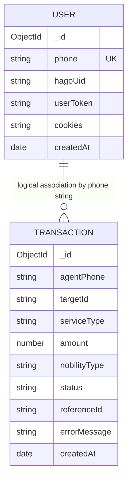

# Database Reference (historical audit)

> This file describes the pre-recovery schemas. Current additions are `User.hagoSession`, session status/validation fields, transaction idempotency/upstream state, and tenant-owned V2 collections; see [Integration Recovery](INTEGRATION_RECOVERY.md) and the [multi-tenant deployment runbook](MULTI_TENANT_DEPLOYMENT.md). It is historical evidence, not the current schema reference.

The application connects with `mongoose.connect(process.env.MONGO_URI)` and declares two Mongoose models. Neither schema enables Mongoose `timestamps`; each instead defines a one-time `createdAt` default. No custom collection names, middleware, virtuals, static methods, relations, or indexes beyond `User.phone` uniqueness are declared.

The diagram's relationship is logical only: `Transaction.agentPhone` is not a Mongoose `ref`, is not validated against `User.phone`, and has no database foreign key.

## `User` model

**Purpose.** Holds a Hago identity/session retrieved after OTP verification, keyed by the submitted phone number. Mongoose's normal naming convention targets the `users` collection.

| Field | BSON/Mongoose type | Required | Default/constraint | Notes |
| --- | --- | --- | --- | --- |
| `_id` | ObjectId | Generated | Mongoose default | Returned unless excluded; no exclusion is configured. |
| `phone` | String | Yes | `unique: true` | Only schema-level uniqueness; no phone format/normalization. |
| `hagoUid` | String | No | None | Set from Hago `h_open_id` after OTP verification. |
| `userToken` | String | No | None | Set from Hago `s_session`; sensitive. |
| `cookies` | String | No | None | Declared but not read or written by current executable source. |
| `createdAt` | Date | No | `Date.now` | Set on initial document creation only. |

**Indexes.** `phone` declares `unique: true`, which Mongoose uses to create a unique index when index creation is enabled. The repository does not include a migration or confirm actual production index state.

**Operations.**

| Operation | Source | Behavior |
| --- | --- | --- |
| Upsert | `authController.verifyOtp` | `findOneAndUpdate({ phone }, { hagoUid, userToken }, { upsert: true, new: true })`. Existing `createdAt` is not updated. |
| Query | `botController.getBalance` | Finds by caller-supplied phone; requires truthy `userToken`. |
| Query | `botController.rechargeDiamond`, `rechargeCrystal`, `buyNobility` | Same lookup/gate before calling service. |
| Query | `botController.getAgentProfile` | Same lookup/gate before profile service call. |
| Delete | No implementation found | No `User` delete route/job/service exists. |

## `Transaction` model

**Purpose.** Records local controller-declared success for diamond, crystal, and nobility routes. Mongoose default naming targets `transactions`. It does not represent a verified ledger from Hago: controller success interpretation and upstream behavior are distinct.

| Field | BSON/Mongoose type | Required | Default/constraint | Notes |
| --- | --- | --- | --- | --- |
| `_id` | ObjectId | Generated | Mongoose default | Returned in list and successful operation responses. |
| `agentPhone` | String | Yes | None | Plain string logical link to `User.phone`. |
| `targetId` | String | Yes | None | Hago target ID/VID supplied by request. |
| `serviceType` | String | Yes | `DIAMOND`; enum `DIAMOND`, `CRYSTAL`, `NOBILITY` | Controller explicitly supplies each value. |
| `amount` | Number | Conditional | Required unless `serviceType === "NOBILITY"` | Nobility controller saves `0`; numeric/range validation is absent. |
| `nobilityType` | String | No | `null`; enum `Knight`, `Viscount`, `Earl`, `Duke`, `null` | Used only by nobility controller. |
| `status` | String | No | `PENDING`; enum `PENDING`, `SUCCESS`, `FAILED` | Current writers only create `SUCCESS`. |
| `referenceId` | String | No | None | Current controllers use a literal fallback/value of `SUCCESS`. |
| `errorMessage` | String | No | None | Declared but no current code writes it. |
| `createdAt` | Date | No | `Date.now` | Used for descending list sorting. |

**Indexes.** No indexes are declared for `agentPhone`, `createdAt`, `status`, target, or reference ID.

**Operations.**

| Operation | Source | Behavior |
| --- | --- | --- |
| Create | `rechargeDiamond` | Creates `DIAMOND/SUCCESS` record after controller success condition. |
| Create | `rechargeCrystal` | Creates `CRYSTAL/SUCCESS` record after controller success condition. |
| Create | `buyNobility` | Creates `NOBILITY/SUCCESS` record after controller success condition. |
| Query | `getAgentTransactions` | Finds all by supplied `agentPhone`, ordered `createdAt: -1`. |
| Update/delete | No implementation found | No status update, delete, reconciliation, or retry persistence exists. |

## Data and security behavior

- Neither schema sets `select: false` for `userToken`; if a `User` document is returned by future code it will include that field by default.
- The API exposes transactions based only on an arbitrary submitted phone; it does not prove caller ownership.
- The database is connected asynchronously during server bootstrap. See [Architecture](ARCHITECTURE.md) for startup timing and [Audit](AUDIT.md) for security/reliability observations.
