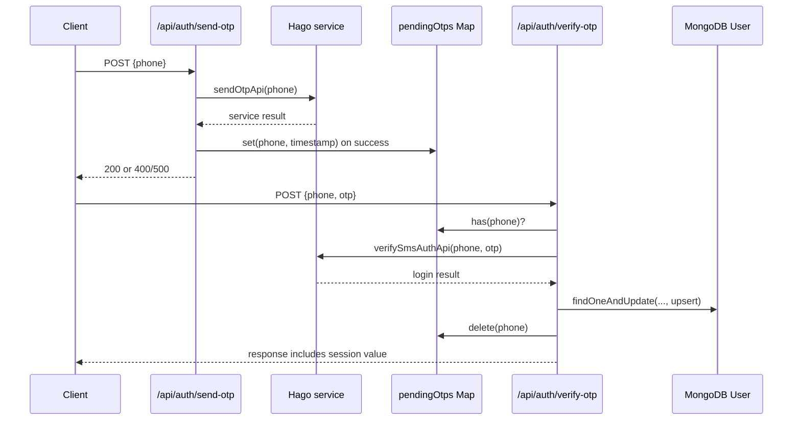
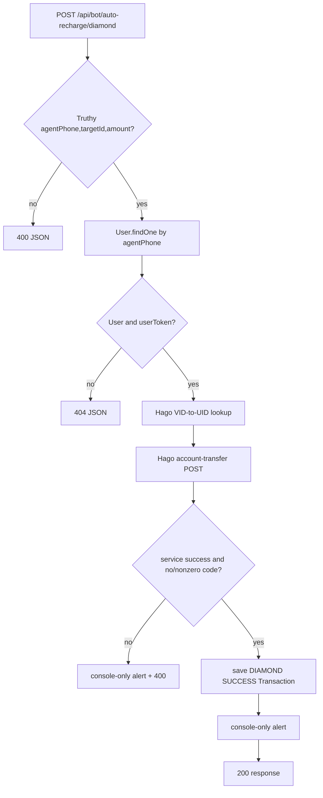
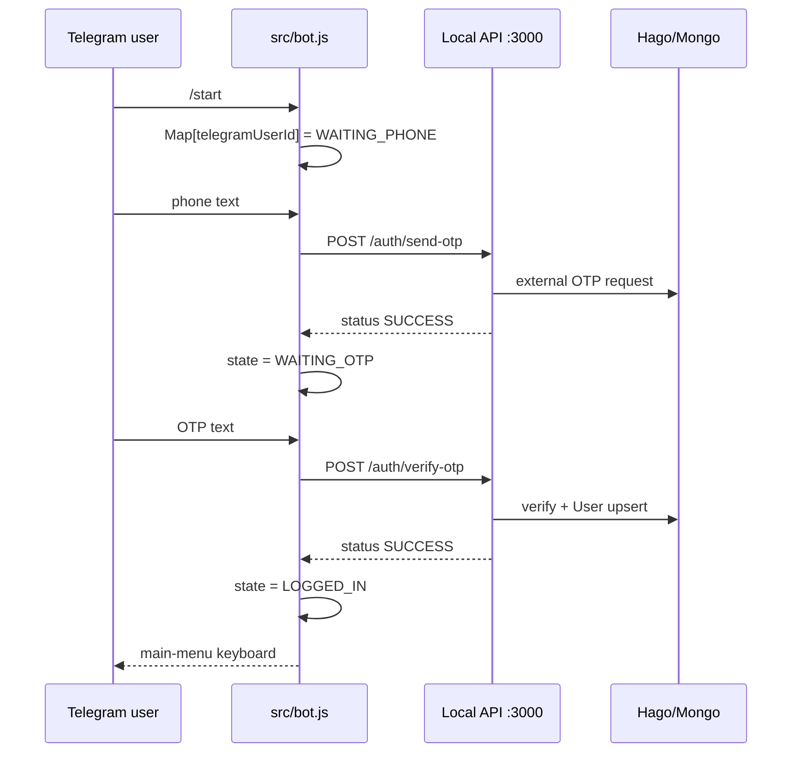

# Runtime and Business Flows (historical audit)

> This file records the pre-recovery flows. The current safe flow is documented in [Integration Recovery](INTEGRATION_RECOVERY.md); in particular, all mutation requests are now disabled and no copied session is used.

This document follows the control flow present in source. Hago's response semantics, external authorization, and the real-world outcome of a transfer are not confirmed from the current repository.

## 1. HTTP OTP login

1. `sendOtp` rejects a falsy `phone` with `400`.
2. `sendOtpApi` performs an external GET. Its Axios catch becomes `success: false`; controller returns `400`. On `success: true`, it sets the module-local pending map.
3. `verifyOtp` requires truthy `phone`/`otp` and a matching pending-map key. It does not inspect the stored timestamp.
4. If the external result has `success`, `data`, and `String(data.result_code) === "0"`, it upserts a `User` and deletes the map key. The returned payload contains the external session value.
5. A failed verification leaves the map entry in place, allowing another attempt while the process remains alive.

Failure notes: there is no OTP expiry, rate limiter, ownership identity, or cross-process persistence. `verifyOtp` has no `try/catch` around external/Mongo operations, so unhandled failures are not a guaranteed JSON API response.

## 2. Diamond recharge

The service first converts `targetId` to a number for the VID lookup. It then generates an in-memory sequence string and posts the transfer payload. The controller considers the operation successful if the service reports success and `rechargeResult.code` is absent or `0`. It records only apparent successful controller outcomes; it does not write failure records, reconcile external state, or ensure idempotency across concurrent requests. The service accepts `agent.userToken` as an argument but does not use it in request construction.

## 3. Crystal recharge and nobility purchase

Both flows have the same initial steps: validate truthy fields, look up user by phone, reject absent/falsy-token user, resolve target VID, call an external endpoint, then save a `Transaction` on controller-declared success.

| Flow | Input-specific rule | Service payload | Saved transaction |
| --- | --- | --- | --- |
| Crystal | Requires truthy `amount` | target UID, numeric transfer amount, generated sequence | `CRYSTAL`, amount, `SUCCESS` |
| Nobility | `nobilityType` must be `Knight`, `Viscount`, `Earl`, or `Duke` | target UID, mapped title integer, literal buyer UID, timestamp | `NOBILITY`, amount `0`, title, `SUCCESS` |

The crystal/nobility services put external output in a `result` property. Their controllers evaluate `result.data?.code`; because `data` is not supplied by those services, an Axios-level successful call generally meets the `!result.data?.code` branch. This exact mismatch is an observation, not a corrected behavior. See [AUDIT.md](AUDIT.md).

## 4. Read operations

| Endpoint | Trigger/input | Database action | External action | Output |
| --- | --- | --- | --- | --- |
| `verify-id` | `targetId` | None | GET user-info by supplied ID | Upstream response in `userInfo` when service considers valid. |
| `wallet-balance` | `agentPhone` | Find User | GET wallet query using stored/fallback UID | Normalized `walletData` with `uid`, `accounts`, `minAmountLimit`, `countryCode`. |
| `agent-profile` | `agentPhone` | Find User | POST UID-profile query using stored/fallback UID | Selected profile fields. |
| `transactions` | `agentPhone` | Find and descending sort Transaction | None | Every local matching transaction. |

The read endpoints provide no authentication or proof that requester controls the phone. The first three require a `User` with a truthy `userToken` even where the downstream service does not use that argument; `transactions` does not require a `User` at all.

## 5. Telegram conversation

The bot stores `phone` and Hago UID in its own map, while `User` is persisted by the API. `/start` for an existing `LOGGED_IN` map entry simply renders the menu. Plain text when no map entry or while logged in receives a prompt to use controls/start.

### Callback actions

| Callback | State requirement | Local API call / local action | Behavior |
| --- | --- | --- | --- |
| `check_balance` | `LOGGED_IN` | `POST /bot/wallet-balance` | Replies only if `response.data.status` succeeds; reads `response.data.balance`, although API provides `walletData`. |
| `start_recharge` | `LOGGED_IN` | None | Changes state to `WAITING_RECHARGE_DATA`. |
| `transaction_history` | `LOGGED_IN` | `POST /bot/transactions` | Shows at most five local transaction records. |
| `logout` | None | Deletes map entry | Does not revoke database or Hago session. |
| `main_menu` | `LOGGED_IN` | None | Renders inline menu. |

### Recharge mismatch

When a user sends `<targetId> <amount>` in recharge state, the bot calls `POST /api/bot/auto-recharge`. No such route is mounted; the API has `/api/bot/auto-recharge/diamond`, `/crystal`, and `/nobility`. Therefore this bot branch cannot reach a controller through the current server routes. It catches the local HTTP error and shows a failure keyboard. It also cannot select crystal/nobility paths from the implemented UI.

### Bot lifecycle and authorization

The bot has no administrator allowlist or chat/user authorization beyond state-key lookup. `agentSessions` is lost on restart and can grow until individual logouts/process exit; there is no expiration task. Telegraf sends messages to the user who triggered the update; the API's `sendAgentNotification` is unrelated and only logs to stdout.

## 6. Browser automation: no flow found

No implementation invokes Puppeteer. The historical package-only dependency was removed from the clean-root adapter. There is no browser launch, page navigation, selector, login form, cookie/local-storage handling, screenshot, retry, concurrency control, or close sequence. Any description of browser interaction with Hago would be speculative and is therefore omitted.
